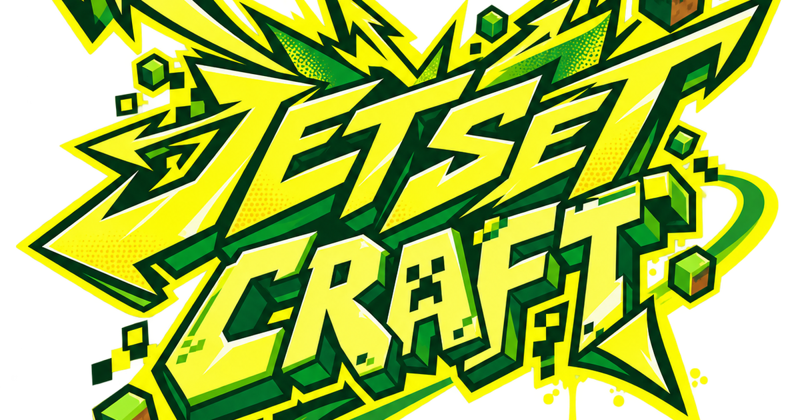
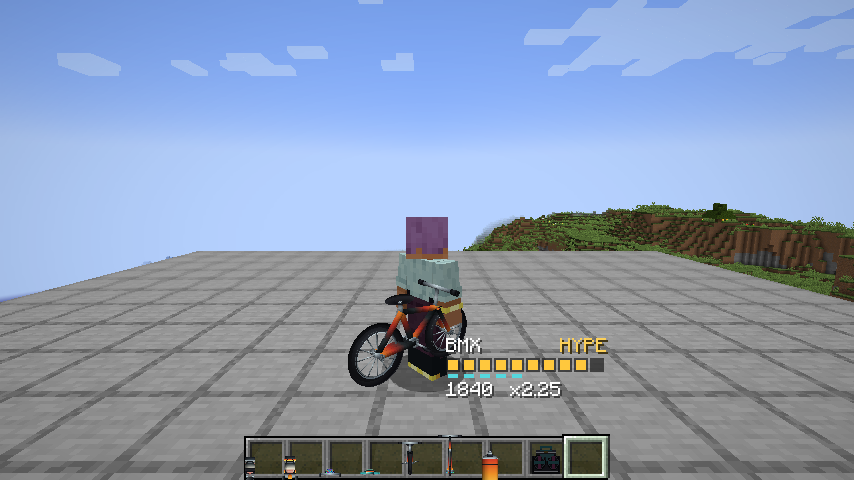
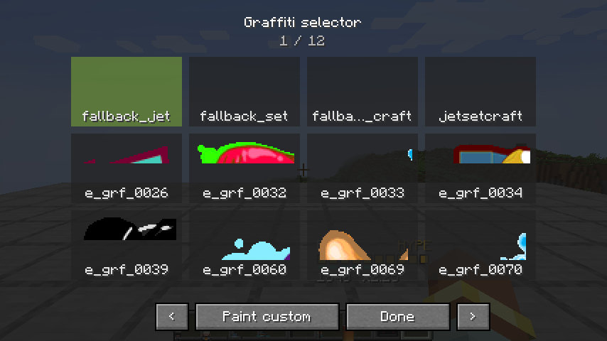
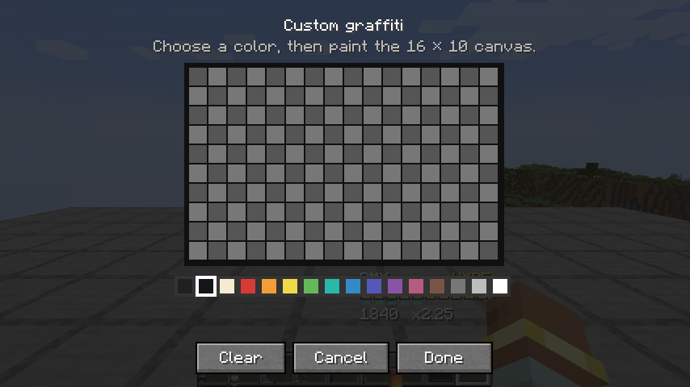

# JetSetCraft

[](https://github.com/Herbertofury/JetSetCraft/actions/workflows/build.yml)
[](https://files.minecraftforge.net/net/minecraftforge/forge/index_1.20.1.html)
[](https://files.minecraftforge.net/net/minecraftforge/forge/index_1.20.1.html)
[](https://github.com/Herbertofury/JetSetCraft/releases/tag/v0.3.0)

JetSetCraft turns ordinary Minecraft terrain into a momentum-first street sports game. Ride, boost, trick, grind, wall-ride, dance, tag walls, equip mobs with Street Gear, and start data-driven gang sessions—without replacing Minecraft’s world, combat, mobs, rails, or movement ecosystems.

## What ships in v0.3.0

- Six persistent ride styles: inline skates, quad skates, street board, BMX, hoverboard, and scooter.
- Twenty-four named tricks and twenty-eight dance moves with combo variety, Flow, boost rewards, landing grades, and multiplayer cyphers.
- Exposed block-edge, fence, wall, pane, vanilla/Forge rail, and optional Create 6.0.8 track grinding.
- Minecraft-native momentum tech across ice, slime, honey, Soul Speed, redstone rails, pistons, explosions, knockback, and small terrain transitions, while vanilla swimming retains complete control.
- A hands-free, server-authoritative ride slot that leaves both hands and the vanilla boots slot available.
- Combat-safe presentation: ride locomotion owns the lower body while item and weapon systems retain arms, hands, held items, and head.
- A 139-entry graffiti gallery plus an in-game 16 × 10 custom-paint canvas, repaint-in-place behavior, support cleanup, durability, and a configurable per-chunk safety limit.
- Persistent Street Gear for compatible vanilla and modded mobs, using conservative anatomy rigs without replacing the original entity, AI, ownership, UUID, or registry type.
- A physical Boombox and mob-head gang tuner with data-pack mappings, safe event-only actors, cleanup/anti-farm rules, and eighty original gang entrance stingers.
- A compact vanilla-adjacent Boost/Flow HUD with an instant `H` toggle, plus reduced-motion, camera, FOV, and trick-name controls.

The [wiki](https://github.com/Herbertofury/JetSetCraft/wiki) covers mechanics, configuration, compatibility, modpack tags, and verification in depth.

## In game







## Install

JetSetCraft targets Minecraft 1.20.1 and Java 17.

1. Install Forge 47.4.10 or newer for Minecraft 1.20.1; the release is built and verified with Forge 47.4.23.
2. Put the JetSetCraft JAR in the instance’s `mods` folder.
3. Install PlayerAnimator `1.0.2-rc1+1.20` on every client. It is not required on a dedicated server.
4. Launch with Java 17. Multiplayer servers and clients must use the same JetSetCraft version.

Create 6.0.8, TACZ 1.1.8-hotfix, Epic Fight, Better Combat, The Aether, Twilight Forest, and other Forge rail/block ecosystems are optional. Missing optional mods do not create registry or data-pack failures.

Official dependencies and compatibility targets: [Forge](https://files.minecraftforge.net/net/minecraftforge/forge/index_1.20.1.html), [PlayerAnimator](https://www.curseforge.com/minecraft/mc-mods/playeranimator/files/4587214), [TACZ](https://www.curseforge.com/minecraft/mc-mods/timeless-and-classics-zero/files/8141310), and [Create](https://www.curseforge.com/minecraft/mc-mods/create/files/7178761).

## Controls

All keys are ordinary Forge mappings and can be rebound.

| Input | Action |
| --- | --- |
| Use ride gear | Equip it to the hands-free ride slot |
| `K` / `Shift + K` | Toggle ride / return equipped gear |
| `H` | Show or hide the compact style HUD immediately |
| `Left Alt` | Boost |
| `R` | Contextual air, grind, or ground trick |
| `G` | Grind or wall-ride |
| `C` | Manual; Hip-Hop dance selector |
| `V` | Brake/powerslide; Breaking dance selector |
| `Space` while grinding | Hop or transfer |
| `B` / `Shift + B` | Dance or change move / stop dancing |
| `W/S/A/D + B` | Select Toprock, House, Locking, or Popping |
| Use spray can in air | Open the paged graffiti selector |
| Shift + use spray can on a block | Open the selector without painting |
| Use spray can on a wall | Paint the selected decal |
| Use ride gear on a mob | Equip persistent Street Gear |
| Sneak + empty-hand use on geared mob | Recover its gear |

## Build and verify

The repository includes the Gradle 8.8 wrapper. Use Java 17:

```text
python -m pip install -r tools/requirements.txt
python tools/generate_models.py
python tools/generate_animations.py
python tools/generate_brand.py
python tools/validate_assets.py
python tools/validate_gameplay_contract.py
python tools/validate_java_syntax.py
python tools/validate_premium_polish.py
python tools/validate_wiki.py
./gradlew clean build
./gradlew runGameTestServer
```

On Windows, use `gradlew.bat`. The JAR is written to `build/libs/`. CI regenerates deterministic assets, rejects dirty generator output, performs a clean build, requires all eight Forge GameTests, starts a real dedicated server, and publishes the JAR, checksums, and logs as one workflow artifact.

In a development world, `/jetsetcraft status` reports authoritative movement and style state. Operators can use `/jetsetcraft build_vanilla_lab` to create a compact acceptance course and `/jetsetcraft set_momentum <speed>` as a controlled test aid. Maintainers can run `gradlew.bat -Djetsetcraft.visualAudit=true runClient` for an unattended real-client ride/HUD/selector/editor capture.

## Architecture and compatibility

Clients send bounded input samples; the server owns movement, scoring, equipment, gang, and persistence state. Tracking clients receive sanitized snapshots. Optional APIs are isolated, optional data-pack entries use `required: false`, no mixins/coremods replace third-party behavior, event actors never force-load chunks, and fake/test players without a network channel remain safe.

See [Architecture](docs/ARCHITECTURE.md), [Compatibility Covenant](docs/STANDALONE_COMPATIBILITY_COVENANT.md), [Asset Provenance](docs/ASSET_PROVENANCE.md), and [Changelog](CHANGELOG.md).

## Rights

Project code and original JetSetCraft content are All Rights Reserved unless a file or ledger entry says otherwise. Third-party/reference inputs retain their own permissions and are not relicensed. See [LICENSE](LICENSE), [THIRD_PARTY_NOTICES.md](THIRD_PARTY_NOTICES.md), and the asset ledger before redistributing or adding external material.
