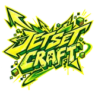

  

# JetSetCraft

## Design references

- [Bedrock skating references + trick/grind surface catalog](docs/JETSETCRAFT_SKATING_REFERENCE_AND_TRICK_SURFACES.md) — skating/rollerblading/skateboarding inspiration, world grind/trick objects, purpose-built grind blocks, and the explicit hoverboard requirement.
- [Vanilla world mechanics synergy](docs/VANILLA_WORLD_MECHANICS_SYNERGY.md) — core doctrine for powered-rail boosts/brakes, boat-like ice speed, slime bounce, honey drag, redstone courses, fluids, pistons, explosions, status effects, enchantments, and other Minecraft-native movement interactions.
