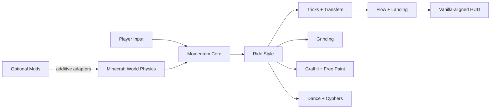

# 🛼 JetSetCraft

> [!IMPORTANT]
> **JetSetCraft turns ordinary Minecraft worlds into a momentum-first street-sports playground without replacing the player, the world, or vanilla control.** Inline skates, quad skates, a street board, BMX, hoverboard, and scooter share one expressive movement language built around tricks, grinding, flow, dance, graffiti, and emergent Minecraft physics.

## ✨ Start here

| I want to… | Go here |
|---|---|
| Install the verified release and take a first ride | **[Getting Started](Getting-Started)** |
| See exactly what is shipped and tested | **[Release & Capability Status](Release-Status)** |
| Understand the complete feature set | **[Feature Overview](Feature-Overview)** |
| Learn every input without permanent forward motion | **[Controls](Controls)** |
| Pick skates, a board, BMX, hoverboard, or scooter | **[Ride Styles](Ride-Styles)** |
| Build tricks, combos, transfers, and Flow | **[Tricks, Combos & Flow](Tricks-Combos-and-Flow)** |
| Paint tags, create custom art, or use Free Paint | **[Graffiti](Graffiti)** |
| Browse the 173-project inspiration atlas | **[Inspiration & Research](Inspiration-and-Research)** |
| Build a compatible modpack or server | **[Modpack Maker Guide](Modpack-Maker-Guide)** |
| Inspect architecture and verification evidence | **[Developer Architecture](Developer-Architecture)** · **[Testing](Testing-and-Verification)** |

## 🎮 The current experience

| Ride, world physics, and compact HUD | Tag selector and custom painting |
|---|---|
|  |  |

## 🟢 What exists today

| System | Shipped surface |
|---|---|
| **Street movement** | Player-controlled stride acceleration, neutral stopping, powerslides, manuals, ledge vaults, wall kicks, wind redirects, world-geometry grinding, transfers, and preserved vanilla swimming. |
| **Ride identities** | Six ride styles with attached player-following models, distinct tuning, 24 tricks, and 72 validated animation clips. |
| **Flow & presentation** | Combo/Flow scoring, landing grades, a compact vanilla-aligned HUD, reduced-motion controls, and 28 dance moves with multiplayer cyphers. |
| **Graffiti** | 139 persistent aspect-aware tags, custom tag creation, Tag/Free Paint modes, 16 colors, six-face splashes, and throwable paint balloons. |
| **Minecraft physics** | Ice, slime, honey, Soul Speed, water, bubbles, redstone rails, pistons, explosions, currents, knockback, and optional Create geometry remain useful movement tech. |
| **Street Gear & gangs** | Reversible gear on compatible source-owned mobs, physical Boombox tuning, data-driven gang identity, bounded actors, anti-farm cleanup, and original entrance stingers. |
| **Verification** | Deterministic asset generation, nine real Forge GameTests, clean client/server builds, dedicated-server smoke, real-client visual audit, and TestGrid protocol proof. |

## 🧭 What makes JetSetCraft different

**The player stays the player.** Weapons, tools, inventory, enchantments, dimensions, mobs, rails, terrain, redstone, fluids, and optional mods remain part of the same play space.

**Neutral means neutral.** Releasing directional input settles through Minecraft friction to a complete stop. Sprint kickoffs, vaults, wall kicks, and redirects require deliberate input—there is no permanent camera-forward motion.

**The world is the skatepark.** JetSetCraft follows real rail shapes, collision-shape ledges, walls, and optional Create tracks rather than requiring a separate course made from special blocks.

**Research is additive.** The project studies excellent work across Java, Bedrock, tools, models, animation, graffiti, music, and vehicles while preserving JetSetCraft's identity and recording permission/provenance boundaries.

## 🚦 Status legend

| Badge | Meaning |
|---|---|
| ✅ **Verified** | Runtime or packaged-artifact evidence exists for the exact release. |
| 🟢 **Implemented** | Present in current source and documented as a current capability. |
| 🧪 **Experimental** | Implemented behind a deliberate compatibility or stability boundary. |
| 📚 **Research** | Inspiration or an implementation reference—not bundled code or a shipped promise. |
| 🚧 **In development** | Active work that is not safe to call complete. |
| 📋 **Design lineage** | Preserved future design, explicitly separated from `0.3.0`. |

## 🔗 Project links

- **Repository:** https://github.com/Herbertofury/JetSetCraft
- **Verified 0.3.0 release:** https://github.com/Herbertofury/JetSetCraft/releases/tag/v0.3.0
- **Research atlas:** https://docs.google.com/spreadsheets/d/1liWhRQL7rmPy8LLgSRVlkrLANqUIJE4UbFX3--KMJjg/edit?gid=1570163195#gid=1570163195
- **Canonical project Drive:** https://drive.google.com/drive/folders/1npHf1VwOj-tybm791XShz2IvY8LmjjUU
- **Roadmap:** [Roadmap](Roadmap)

> [!NOTE]
> Territory, reputation, chapters, posse systems, Junior Atlas, and expanded competitive modes are preserved as design lineage unless the **[Release Status](Release-Status)** page marks them shipped.

---

**New here?** Continue with **[Getting Started →](Getting-Started)**.
